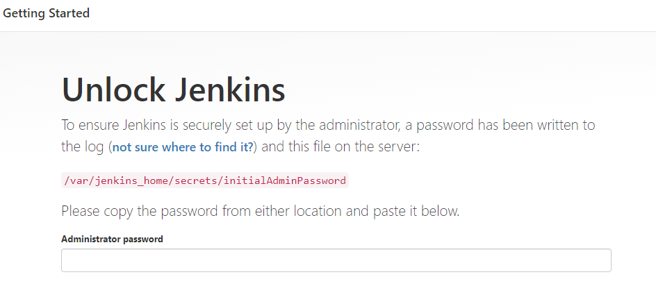
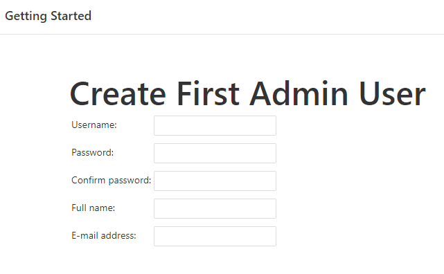
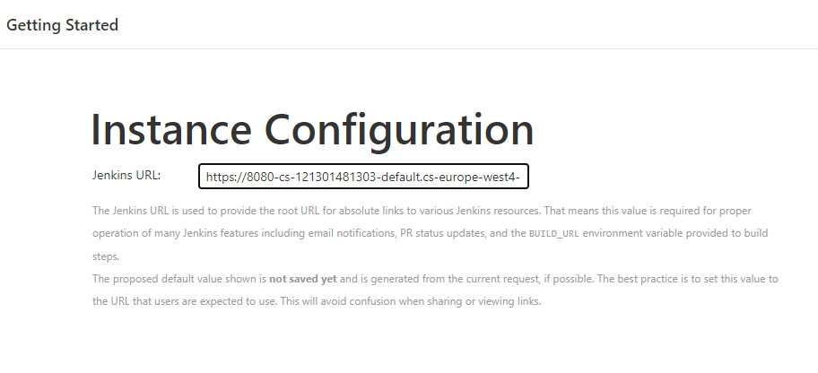
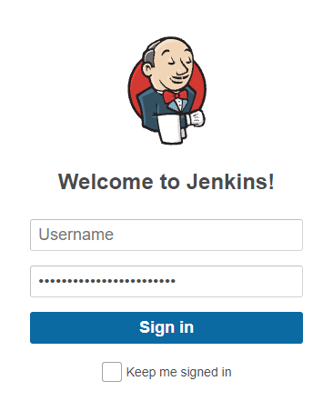
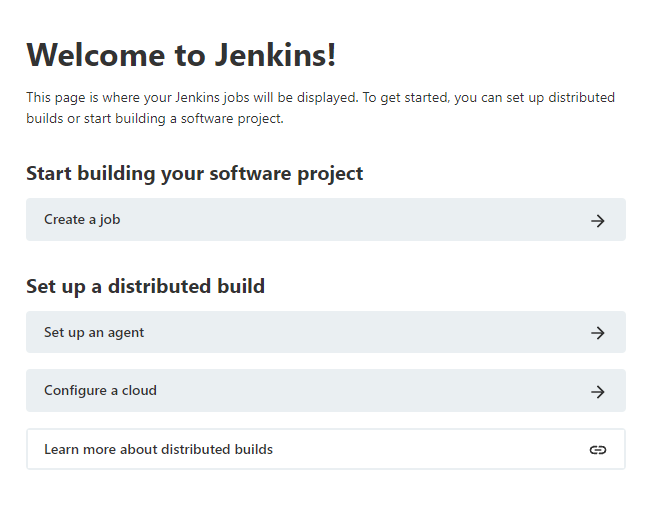

----
## Jenkins Labs - Run Jenkins Server (As Docker Image)

[](https://console.cloud.google.com/cloudshell/editor?cloudshell_git_repo=https://github.com/nirgeier/JenkinsLabs)

### **<kbd>CTRL</kbd> + click to open in new window**   

---

## Preface
- For this demo we will use Jenkins as docker container. 
- Our image is build upon [`jenkinsci/blueocean`](https://hub.docker.com/r/jenkinsci/blueocean/)

<!-- inPage TOC start -->

---
## Lab Highlights:
- [01. Run Jenkins Server](#01-Run-Jenkins-Server)
  - [01.01. Docker command in details](#0101-Docker-command-in-details)
- [02. Test Jenkins Server](#02-Test-Jenkins-Server)
  - [02.01. Unlocking Jenkins](#0201-Unlocking-Jenkins)
  - [02.02. Customizing Jenkins with plugins](#0202-Customizing-Jenkins-with-plugins)
  - [02.03. Creating the first administrator user](#0203-Creating-the-first-administrator-user)
  - [02.04. Instance Configuration](#0204-Instance-Configuration)
  - [02.05. Login to Jenkins](#0205-Login-to-Jenkins)
- [03. Start using Jenkins](#03-Start-using-Jenkins)

---

<!-- inPage TOC end -->

---
## 01. Run Jenkins Server
```sh
# Start jenkins server as container
# Run the following command
docker run \
    -u root \
    --rm \
    -d \
    -p 8080:8080 \
    -v ${PWD}/jenkins_home:/var/jenkins_home \
    -v /var/run/docker.sock:/var/run/docker.sock \
    jenkinsci/blueocean
```
### 01.01. Docker command in details
**You can skip to the next section if you don't care about the details**

```sh
docker run \

    # Use root user as the container user
    -u root \
    
    # (Optional) Automatically removes the Docker container when it is shut down. 
    --rm \
    
    #  ( Optional ) Runs the jenkinsci/blueocean container in the background 
    # (i.e. "detached" mode) and outputs the container ID. 
    # If you do not specify this option, then the running Docker log
    # for this container is output in the terminal window.
    -d \

    # Makes (i.e. "publishes") port 8080 of the jenkinsci/blueocean container to
    # port 8080 on the host machine. 
    # The 1st number represents the port on the host while the 
    # 2nd represents the container’s port. 
    # Therefore, if you specified -p 49001:8080 for this option, you would be
    # accessing Jenkins on your host machine through port 49001.
    -p 8080:8080 \

     # Maps the /var/jenkins_home directory in the container to the local file system. 
    -v ${PWD}/jenkins_home:/var/jenkins_home \

    # /var/run/docker.sock is the Unix socket the Docker daemon listens on by default. 
    # It is used to communicate with the Docker daemon from within a container
    -v /var/run/docker.sock:/var/run/docker.sock \

    # The image which we are using
    jenkinsci/blueocean
```

## 02. Test Jenkins Server
- Wait for the server to load and than open your browser at port 8080 
- Wait for Jenkins to display the Login page

### 02.01. Unlocking Jenkins



- Now we need to grab the initial password
    ```sh
    # Get the initial password
    sudo cat ${PWD}/jenkins_home/secrets/initialAdminPassword
    ```

### 02.02. Customizing Jenkins with plugins
- After unlocking Jenkins, the Customize Jenkins page appears. 
- Here you can install any number of useful plugins as part of your initial setup.
    - Click one of the two options shown:
        - Install suggested plugins - to install the recommended set of plugins, which are based on most common use cases.
        - Select plugins to install - to choose which set of plugins to initially install. 
        
    - When you first access the plugin selection page, the suggested plugins are selected by default.

### 02.03. Creating the first administrator user
- Finally, after customizing Jenkins with plugins, Jenkins asks you to create your first administrator
user.
    - When the Create First Admin User page appears, specify the details for your administrator
user in the respective fields and click Save and Finish.

    

### 02.04. Instance Configuration
- Leave this field as as for now
- Proceed to next step
- When the Jenkins is ready page appears, click Start using Jenkins.



### 02.05. Login to Jenkins
- Fill in the username/password which you have created in previous steps



## 03. Start using Jenkins
