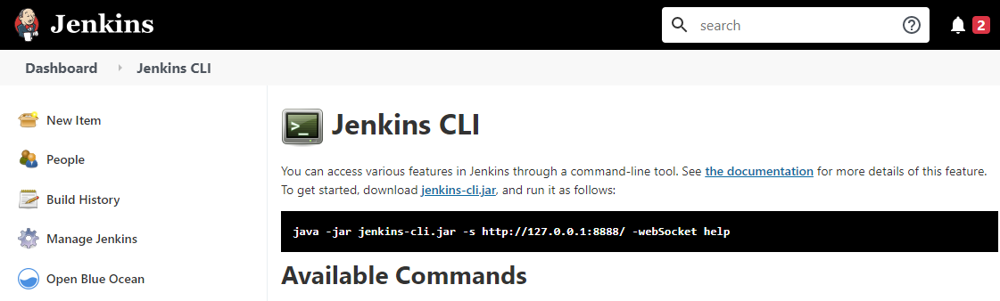
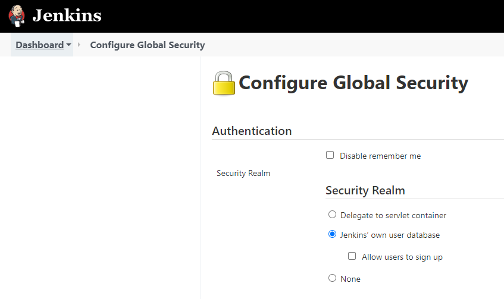

----
# Jenkins Labs - Using Jenkins CLI

[](https://console.cloud.google.com/cloudshell/editor?cloudshell_git_repo=https://github.com/nirgeier/JenkinsLabs)

### **<kbd>CTRL</kbd> + click to open in new window**   

---

### 01. Download the Jenkins CLI
- Navigate to `<jenkins_server_url>/cli` and copy the wget command to download the Jenkins_cli tool.

```sh
# Download the Jenkins cli tool
wget http://<jenkins_server_url>/jnlpJars/jenkins-cli.jar
```



<!-- inPage TOC start -->

---
## Lab Highlights:
- [01. Download the Jenkins CLI](#01-Download-the-Jenkins-CLI)
- [02. Adding user within the GUI](#02-Adding-user-within-the-GUI)
- [03. Adding user using jenkins-cli](#03-Adding-user-using-jenkins-cli)

---

<!-- inPage TOC end -->

### Adding Users


### 02. Adding user within the GUI
- Navigate to `Manage Jenkins > Configure Global Security` or to: `<jenkins_server_url>/configureSecurity/`
- Under `Authentication > Security Realm` you will find 3 options:
    - Delegate to servlet container
    - **Jenkins’ own user database**
    - None
- Here, we are creating user under `Jenkins’ own user database`. 
    
- Click `Save`
- Fill in the user details and `Create ...`

---

### 03. Adding user using jenkins-cli
- Assuming you already have the `jenkins-cli`, if not get it [here](../02-Download-Jenkins-CLI)
- We will use the API to create new user
```sh
# Define the desired user and password
# Execute the API command for creating the user
echo 'jenkins.model.Jenkins.instance.securityRealm.createAccount("<username>", "<password>")' \
| java -jar jenkins-cli.jar -s <jenkins_server_url> groovy =
```