----
# Jenkins Labs - Building Manual Jobs Pipeline 
---

- In this lab we will build a pipeline of multiple jobs in a manual way

<!-- inPage TOC start -->

---
## Lab Highlights:
- [01. Creating Jobs](#01-Creating-Jobs)
  - [01.01. Creating Job 1](#0101-Creating-Job-1)
  - [01.02. Creating Job 2](#0102-Creating-Job-2)
  - [01.03. Creating Job 3](#0103-Creating-Job-3)
- [02. Building the pipeline](#02-Building-the-pipeline)
- [02.01 Set the relationship **Job1 -&gt; Job2**](#0201-Set-the-relationship-Job1---Job2)
- [02.02 Set the relationship **Job2 -&gt; Job3**](#0202-Set-the-relationship-Job2---Job3)
- [03. UpStreams and DownStreams](#03-UpStreams-and-DownStreams)
- [04. Install Pipeline Plugin](#04-Install-Pipeline-Plugin)
- [05. Create Pipeline View](#05-Create-Pipeline-View)

---

<!-- inPage TOC end -->
---

### 01. Creating Jobs
### 01.01. Creating Job #1
- `Dashboard > New item`
    - Enter an item name (Job1)
    - Choose free style project
    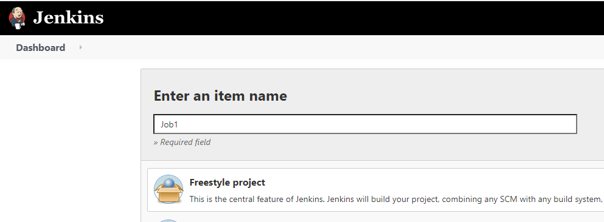
    - Click `Ok`
    - Add build phase (Execute shell) and set some command
    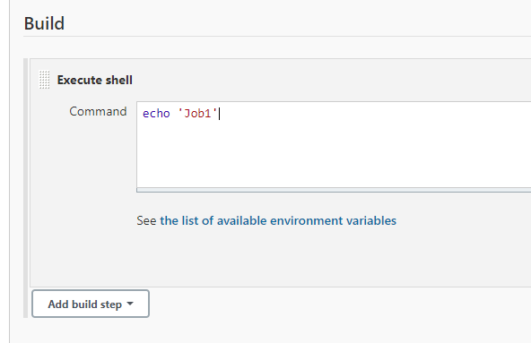
    - Click 'Save'

### 01.02. Creating Job #2
- `Dashboard > New item`
  - Enter an item name (Job2)
  - This time we will use an existing job as our base job. Choose the last option `Copy From` and in the text field use Job1 from prevoius step
  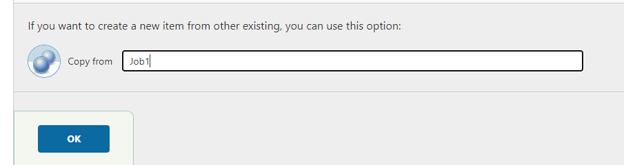
  - Click `Ok`
  - Once the `Configuration` screen is displayed, set the desired command for this job
  - Click `Apply`

### 01.03. Creating Job #3
- Repeate the same as when you created Job#2

---

### 02. Building the pipeline
- Our pipeline will be `Job1 > Job2 > Job3`.
- Each job should run only if the previous one succeed.

### 02.01 Set the relationship **Job1 -> Job2**
- Open `Job1` configurations and under the `Post Build Actions` select `Build Other Projects` and select `Job2`.
 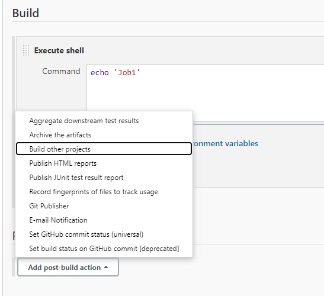
  
 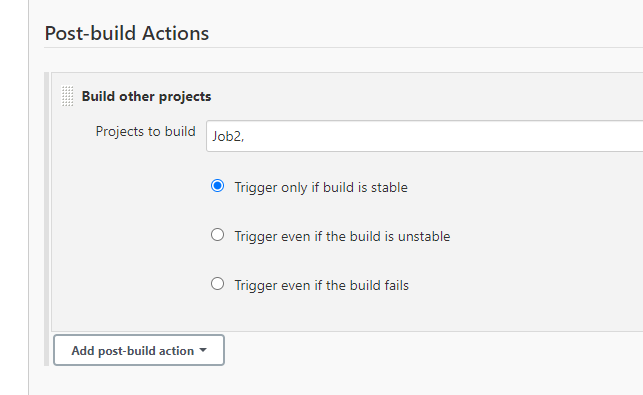
- Click `Apply` 
 
 #### 02.02 Set the relationship **Job2 -> Job3**
 - Open `Job3` configurations and under the `Build Triggers` select `Build after other projects are built` and set it to Job2.

 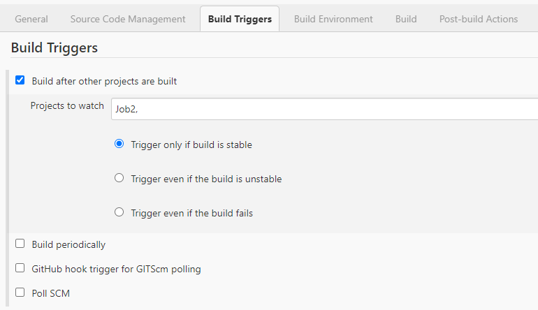

 ---
### 03. UpStreams and DownStreams
- Jenkins calls these connections `UpStreams` and `DownStreams`. 
- In the context of `Job1`, `Job2` defined as `Downstream`.
- In the context of `Job2`, `Job1` is `Upstream` and so on

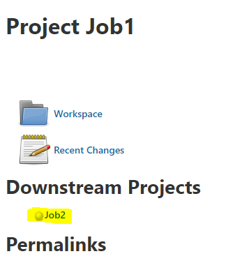

---

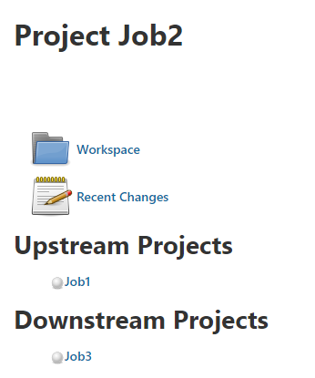

---

### 04. Install Pipeline Plugin
- To get a better view of the complete pipeline and the workflow, install the `Build Pipeline` plugin which allows creation of a special view for connected jobs.

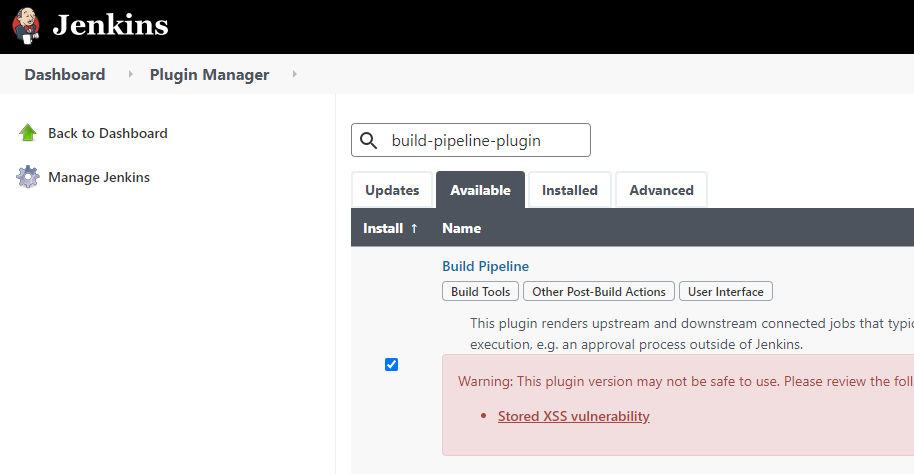

### 05. Create Pipeline View
- From Jenkins dashboard click on the `+` in the main view panel.
- Provide a name to the view 
- Check `Build Pipeline View`. 
- Click `OK`

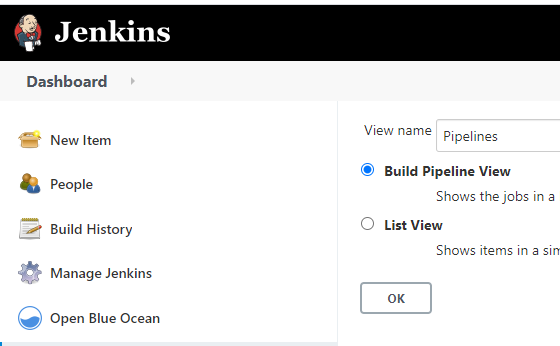

- Verify that the configuration is the following:
    - Here you can set the number of build to display as well

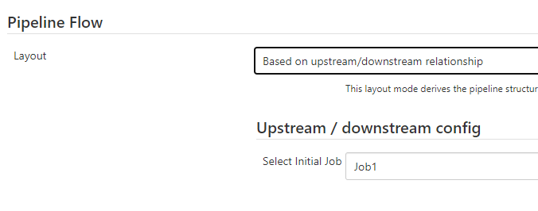

- Click `Ok`
- Navigate to the and you should see the pipelines

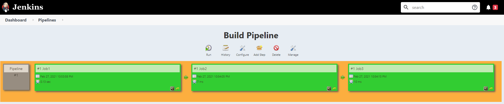

- Pipeline view also shows the history of job runs up to the number of instances you selected earlier in the configuration.