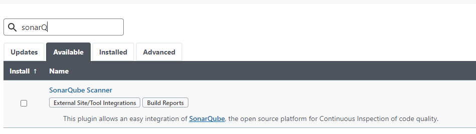
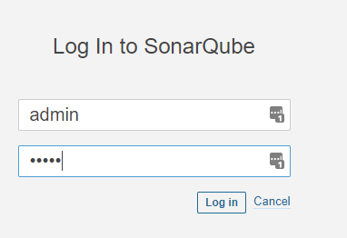
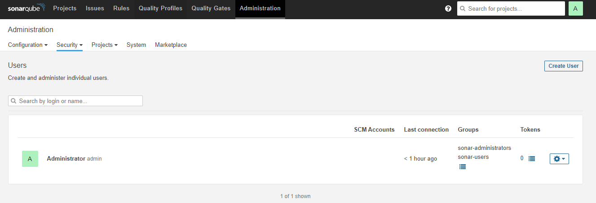
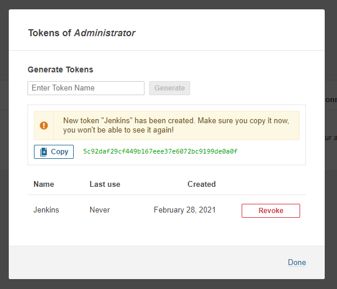
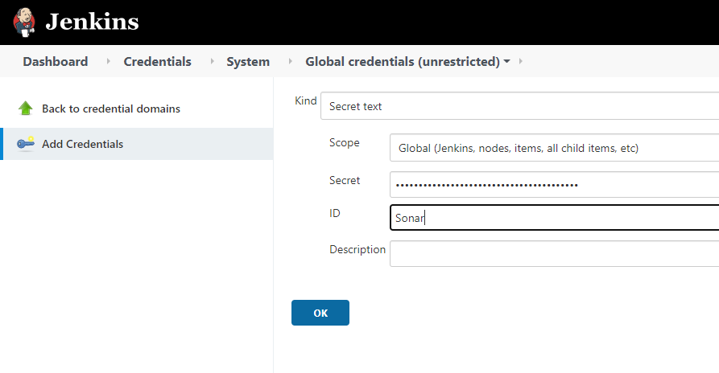
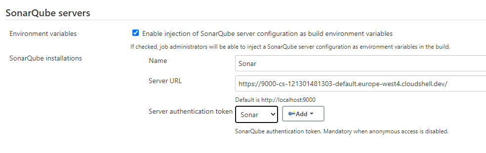

----
# Jenkins Labs - SonarQube
---

- In this lab we will test our code with SonarQube
- We will run SonarQube as docker contaienr

### Install Sonarqube Plugin in Jenkins
- `Manage Jenkins => Manage Plugins`


### Running SonarQube as a Docker Container
```sh
# Run SonarQube docker container.
docker run -idt  --name sonarqube -p 9000:9000 -p 9092:9092 sonarqube
```

### Generate SonarQube Token
- Opne SonarQube UI (http://YourIP:9000)
- Login using following (default) credentials:
    ```
    user: admin
    pass: admin
    ```
  
- Update the password as required on first login
- Click on `Administration` Tab. 
- Under `Security` drop down menu, select Users.
- For Administrator User, click on `Tokens`.
  

- Copy the token and save it 
  


### Configure Sonarqube Plugin

#### Add the Sonar Token
- `Manage Jenkins => Manage Credentials` click onthe `Jenkins` user under store, click on the `Global credentials (unrestricted)` and add the token as described below


#### Set the Sonar Server
- `Manage Jenkins => System Configuration => Configure System`
- Under SonarQube section click on `Add SonarQube`.
- Click on `Advanced`
- Check the following:
  `Enable injection of SonarQube server configuration as build environment variables`
- Set the values:  
  
  ```
  Name      : SonarQube
  Server URL: http://YourIP:9000
  Token     : <Token from previous step>
  ```
- Click `Apply`.

  

---
### Run Sonar Analysis
- Lets add A job for this task
- Click on `New Items`
- Create a new Freestyle Project and give it a name
- Add Git SCM Repository Configuration and add any desired project
- Under `Build Triggers`, select `Build After Other Projects are Built`
- Under `Build Environment`, check `Prepare SonarQube Scanner environment`.