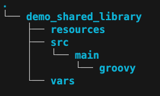

----

## Jenkins Labs - Shared Library

[](https://console.cloud.google.com/cloudshell/editor?cloudshell_git_repo=https://github.com/nirgeier/JenkinsLabs)

### **<kbd>CTRL</kbd> + click to open in new window**   

---

- [Jenkins Labs - Shared Library](#jenkins-labs---shared-library)
  - [**CTRL + click to open in new window**](#ctrl--click-to-open-in-new-window)
- [Preface](#preface)
  - [Step 01 - Create Git Repository](#step-01---create-git-repository)
  - [Step 02 - Create Folder Structure](#step-02---create-folder-structure)
  - [Step 03 - Create Shared Library](#step-03---create-shared-library)


---

## Preface 
- A `Jenkins` **Shared Library** is a collection of **reusable Groovy scripts** that can be used across multiple Jenkins jobs12. 
- A `Jenkins` **Shared Library** stored in Git repositories, and each shared library requires a `name` and a `method` for retrieving source code

---

### Step 01 - Create Git Repository

```sh
# You can create git repo under any git repository.
# In this sample we will use github 

# You can create repository  using GitHub UI or CLI.

###
### Using GitHub CLI [https://github.com/settings/tokens]
###
# Generate your GitHub token if you wish to create it using API
# replace the token and run the command line
curl \
     -H     "Authorization: token <YOUR TOKEN>"     \
     --data '{"name":"sharedLibraryDemo"}'          \
     https://api.github.com/user/repos
```

### Step 02 - Create Folder Structure

- Create the folder structure

    

```sh
# Remove old content
rm -rf _demo
mkdir -p _demo
cd _demo

# Create the root folder & Init the gir repository
git init demo_shared_library

# Create the skeleton folders
mkdir -p demo_shared_library/{src/main/groovy,vars,resources}

# Verify the skeleton structure
tree .
```

| Folder                  | Description                                                      |
| ----------------------- | ---------------------------------------------------------------- |
| **demo_shared_library** | Root of your `Shared library` project                            |
| **resources**           | Static resources (e.g., script, images, configurations etc)      |
| **src**                 | Store the shared library groovy scripts                          |
| **vars**                | Vars folder contains `global` variables for the shared libraries |

  - ### `src`

    - The **src** directory is structured like a standard Java project. 
    - The `src/main/groovy` is where you will store all your Groovy scripts (`Shared library` code).
    - `import` statement wil be used to import `Shared library` classes from the src directory.

  - ### `vars`
    - The **vars** directory contains **global variables** which are used in the shared library. 
    - These variables are visible to any Jenkins job that `import`s the shared library.

  - ### `resources`
    -  The **resources** directory contains static resources (images, binaries, scripts etc).

---

### Step 03 - Create Shared Library

- In this demo we will create two simple shared libraries:
  - A `Utility` library with one method `sayHello`.
  - A second library to checkout Git repository.